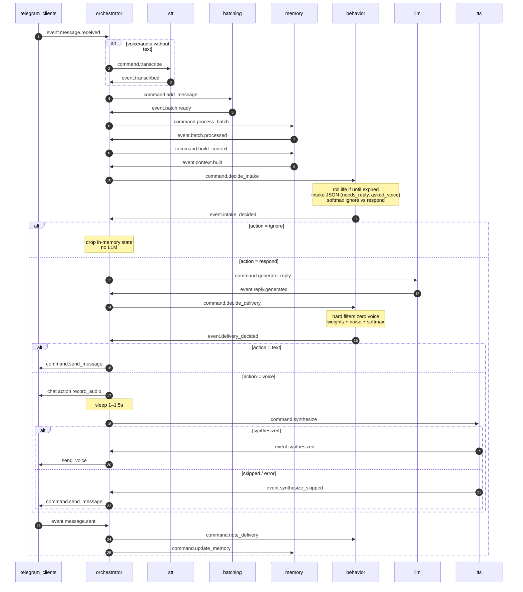
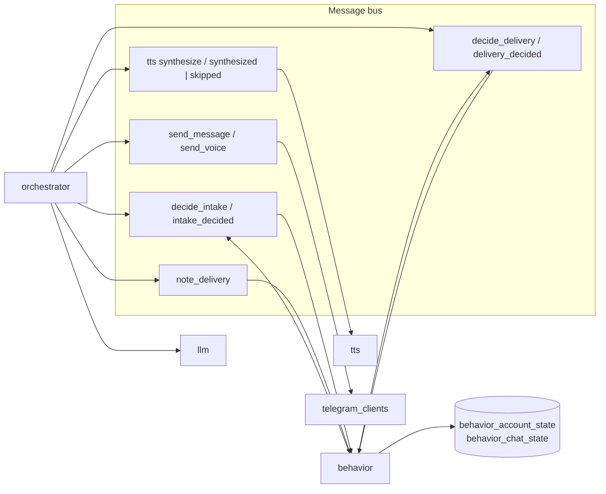

# Behavior: reply modality (ignore / text / voice)

Weighted, slightly noisy choice of **how** the companion responds. v1 actions: `ignore`, `text`, `voice`. Delay and sticker are reserved in the action enum with weight 0.

## Decisions (locked)

- Intake (ignore vs generate) runs **before** LLM reply. Delivery (text vs voice) runs **after** reply text exists.
- v1 does **not** send delayed replies or stickers.
- Agent “life” (activity + mood) is **one row per Telegram account**, not per chat.
- Subjective bits: cheap JSON on the **incoming** batch before generate; after generate — code + optional 0/1 emotion flag. “Want to speak” is **not** an LLM question; it comes from life state + noise.
- Winner is **softmax / weighted random**, not argmax. Hard filters zero the voice weight.
- Persistence and scoring live in a **new module** `behavior`, not in `orchestrator` or `telegram_clients`.

## Out of scope (v1)

- Actions `delay` and `sticker` (enum + zero weights only).
- Per-user adaptation from “listened to the end”.
- HTTP API / admin UI for mood.
- Background worker / Kafka cron for life rotation (roll lazily on intake).
- Redis.
- Changing STT.

## Pipeline

Current:

```
TG → (STT) → batch → memory process → context built → LLM generate → TG send text
```

Target:

```
TG → (STT) → batch → memory process → context built
  → behavior.decide_intake
       ignore → stop (incoming already in memory; no LLM)
       respond → LLM generate
            → behavior.decide_delivery
                 text  → TG send_message
                 voice → typing/record action + 1–1.5s → tts.synthesize
                            synthesized → TG send voice
                            skipped/error → TG send_message (same text)
```

Memory is **not** skipped on ignore. The companion still remembers; it just does not answer this turn.

### Sequence (v1)



### Modules and data



## Module layout

Bus + persistence, same family as `memory` (not empty-orchestrator):

```
src/modules/behavior/
  models.py
  repository.py
  service.py
  handlers.py
  dependencies.py
  exceptions.py
  engine.py           # Policy, DecisionContext, decide()
  criteria.py         # one class per scoring parameter
  filters.py          # hard blockers
  policies.py         # INTAKE_POLICY, DELIVERY_POLICY
  scoring.py          # emotion helpers, word_count
  life.py             # roll activity/mood when until expired
  classifiers.py      # IntakeClassifier protocol + ChatProvider adapter
  prompts/intake.md
  schemas/events.py
```

No `routers/` in v1. Register handlers in `main.py` next to llm/stt. `build_behavior_service()` for bus handlers (ADR §6).

### Topics (`src/core/bus_topics.py`)

| Topic | Kind |
|---|---|
| `behavior.command.decide_intake` | command |
| `behavior.event.intake_decided` | event |
| `behavior.command.decide_delivery` | command |
| `behavior.event.delivery_decided` | event |

Commands are `BaseModel` without `to_bus_dict`. Events subclass `BaseEvent`.

### Commands / events

`DecideIntakeCommand`: `conversation_id`, `telegram_account_id`, `telegram_chat_id`, `context`, `batch_messages` (list of `Message` or the same shape memory already emits: `text`, `message_type`).

`IntakeDecidedEvent`: ids + `action` (`ignore` \| `respond`) + `scores` (dict of action → float, for logs) + `life` snapshot (`activity`, `mood`) + `intake_signals` (`needs_reply`, `asked_voice`).

`DecideDeliveryCommand`: ids + `messages` (outgoing `Message` list from LLM) + `batch_messages` (incoming, for mirroring) + optional `emotion` int 0/1 if LLM already parsed it.

`DeliveryDecidedEvent`: ids + `action` (`text` \| `voice`) + `text` (joined or first-message policy below) + `scores` + `blocked_voice` (bool + reasons list).

v2 actions `delay` / `sticker` may appear in `scores` as 0; they must not win.

## Persistence

### `behavior_account_state`

| Column | Notes |
|---|---|
| `account_id` | PK, FK `telegram_account.id` ON DELETE CASCADE |
| `activity` | enum string: `working`, `resting`, `running`, `public`, default `working` |
| `mood` | enum string: `good`, `neutral`, `bad`, default `neutral` |
| `activity_until` | timestamptz UTC |
| `updated_at` | timestamptz UTC |

One row per account, created on first intake if missing.

### `behavior_chat_state`

| Column | Notes |
|---|---|
| `id` | UUID PK |
| `account_id` | FK cascade |
| `chat_id` | BigInteger |
| `consecutive_voice_out` | int, default 0 |
| `last_delivery` | `text` \| `voice` \| null |
| `updated_at` | timestamptz |

Unique `(account_id, chat_id)`.

Alembic migration in the usual `alembic/versions/` style.

**Lazy life roll:** on intake, if no row or `activity_until <= now(UTC)`, pick new `activity` uniformly from the four values, `mood` uniformly from three, `activity_until = now + uniform(2h, 4h)`. No extra process.

Timezone for “night” (22:00–06:00): setting `BEHAVIOR_TIMEZONE` default `Europe/Moscow`. Convert `datetime.now(UTC)` to that zone before the hour check.

## Extensibility (locked)

Scoring is a **policy engine**, not a growing `if` chain. Adding a parameter or a new choice must not rewrite softmax, orchestrator routing of *existing* actions, or persistence.

Three extension knobs:

| Knob | What you add | What you do not touch |
|---|---|---|
| New **parameter** (criterion) | One class implementing `Criterion.deltas(ctx) -> {action: float}` and append it to a policy’s `criteria` tuple | Engine, filters, other criteria |
| New **blocker** | One class implementing `ActionFilter.blocked(ctx) -> {action: reason}` and append to `filters` | Engine, criteria |
| New **choice** (action) | Name in `legal_actions` + `base_weights`; criteria/filters that mention it; **one** orchestrator branch for how to execute it | Other actions’ execution; scoring math |

Unknown actions in a criterion’s delta dict are **ignored** (so a delivery criterion may emit `ignore +5` and intake still applies it, while delivery policy drops it). Filters that block an action not in `legal_actions` are no-ops.

`DecisionContext.extra: dict[str, Any]` holds future signals (new classifier bits, user prefs) without changing every criterion signature. v1 keys live as first-class fields (`needs_reply`, `asked_voice`, `emotion`, texts, life, chat, `now`).

Policies are data:

```python
INTAKE_POLICY = Policy(
    name="intake",
    legal_actions=("ignore", "respond"),
    base_weights={"respond": 50, "ignore": 10},
    criteria=(NeedsReplyCriterion(), GreetingIntakeCriterion(), LifeIgnoreCriterion(), MoodIgnoreCriterion()),
    filters=(),
    fallback="respond",
)
DELIVERY_POLICY = Policy(
    name="delivery",
    legal_actions=("text", "voice"),  # v2: add "sticker", "delay"
    base_weights={"text": 40, "voice": 20},
    criteria=(...),
    filters=(VoiceHardFilter(),),
    fallback="text",
)
```

v2 `delay` / `sticker`: append to `DELIVERY_POLICY` (or a third policy), add criteria, add orchestrator execution. Do **not** bake them into v1 legal sets (weight 0 still lets softmax pick them if noise + leftover mass — so they stay **out** of `legal_actions` until implemented).

Layout:

```
src/modules/behavior/
  engine.py          # DecisionContext, Policy, decide(), noise, softmax
  criteria.py        # one class per parameter (small, named)
  filters.py         # VoiceHardFilter, ...
  policies.py        # INTAKE_POLICY, DELIVERY_POLICY
  scoring.py         # emotion strip/detect helpers used by service + criteria
```

Tests: engine with a fake criterion/filter (proves plugins work) plus unit tests per real criterion. Do not require a YAML/plugin directory in v1 — Python tuples are the registry.

## Scoring (pure, unit-tested)

v1 actions: intake `{ignore, respond}`, delivery `{text, voice}`. Engine: base weights → sum criterion deltas (only legal keys) → filters zero blocked actions → ±5% noise → clamp ≥ 0 → softmax sample. Fallback if all mass is 0.

### Hard filters (voice only)

Any match → `voice` weight forced to 0, reason recorded:

- Consecutive digits of length ≥ 5 (phones, order ids)
- URL-like: `http://`, `https://`, `t.me/`
- Markup: triple backticks, `| ... |` table-ish, leftover markdown emphasis density (implementation: backticks or a line starting with `#` or `|`)
- Word count of the **outgoing** text < 4

Filters run on the text that would be spoken (delivery stage). Intake does not use them.

### Objective deltas (code)

Word = whitespace split. Incoming = concatenated batch texts. Outgoing = concatenated reply messages.

| Signal | Effect |
|---|---|
| Outgoing > 15 words | `voice` +25, `text` −10 |
| Incoming `message_type` in `{voice, audio}` | `voice` +30, `text` −10 (mirror) |
| `consecutive_voice_out` in {1, 2} | `voice` +10 |
| `consecutive_voice_out` ≥ 4 | `voice` −40, `text` +25 |
| `last_delivery == text` and outgoing > 15 words | `voice` +15 (style switch) |
| Local hour in 22–05 inclusive | `voice` +20, `text` −10 |
| Incoming > 20 words | `voice` +15, `text` −5 |
| Incoming ≤ 3 words and matches greeting lexicon (`привет`, `здарова`, `хай`, `йо`, case-insensitive) | `text` +15, `voice` −20, `ignore` +5 |

### Life deltas

| State | Effect |
|---|---|
| `working` | `text` +25, `voice` −15, `ignore` +5 |
| `resting` | `voice` +25, `ignore` +15, `text` −10 |
| `running` | `voice` +40, `text` −20, `ignore` +10 (v2 would boost `delay`; v1 ignore/voice only) |
| `public` | `text` +25, `voice` −30, `ignore` +15 |
| `mood=good` | `text` +5, `ignore` −10 |
| `mood=bad` | `ignore` +25, `text` −10, `voice` −10 |
| `mood=neutral` | none |

### Subjective deltas

**Intake classifier** (before generate), prompt `behavior/prompts/intake.md`, JSON only:

```json
{"needs_reply": 0, "asked_voice": 0}
```

- `asked_voice=1` → stored for delivery (`voice` +50 later)
- `needs_reply=0` → `ignore` +40, `text` −15
- `needs_reply=1` → `ignore` −25

Failures, empty, or invalid JSON → `needs_reply=1`, `asked_voice=0` (fail-open: answer).

**“Want to speak”:** not classified. If `activity in {resting, running}` add `voice` +10; extra ± already in noise.

**Emotion (delivery):**

1. If outgoing contains `!` or emoji (unicode emoji ranges / common emoticons) → `emotion=1`.
2. Else if the model appended a last line `{"emotion":0|1}` (stripped from user-visible text before send) → use that.
3. Else `emotion=0`.

`emotion=1` → `voice` +20, `text` −5.

Do **not** add a second full chat completion for delivery in v1.

### Noise and sample

For each action weight `w`: `w' = w * Uniform(0.95, 1.05)`. Then `w'' = max(w', 0)`. If all zero, fall back to `text` on delivery and `respond` on intake.

Softmax with temperature `BEHAVIOR_SOFTMAX_TEMP` default `1.0`. Sample one action.

Intake legal set: `ignore`, `respond`. Internally map `text`+`voice` mass into `respond` **or** score only `{ignore, respond}` using the ignore-related deltas vs a `respond` base of 50. Spec choice: **two-class intake** — start `respond=50`, `ignore=10`, apply only ignore/life/needs_reply/greeting deltas (not voice-length). Delivery is three-class among remaining.

This avoids “voice weight high so we must respond” coupling. Asked-voice does **not** force respond if `needs_reply=0` and ignore wins; it only matters at delivery.

### Base weights (delivery)

`text=40`, `voice=20`, `ignore` not in delivery.

## Orchestrator changes

On `MEMORY_CONTEXT_BUILT`: publish `decide_intake` (pass context + batch messages from state; orchestrator must keep `batch_messages` on `OrchestratorState`).

On `intake_decided`:

- `ignore` → drop in-memory orchestrator state for that chat; do not generate. Do not fake `LLM_REPLY_SUPPRESSED` unless we want one reason for metrics — **do not**; `intake_decided` is the audit event.
- `respond` → existing `LLM_GENERATE_REPLY`.

On `LLM_REPLY_GENERATED`: publish `decide_delivery` instead of looping `TG_MESSAGE_SEND`.

On `delivery_decided`:

- `text` → current send loop (one `TG_MESSAGE_SEND` per message).
- `voice` → `SetTyping`/`SendChatAction` record-audio if the Telegram adapter exposes it; `asyncio.sleep(uniform(1.0, 1.5))`; publish `tts.command.synthesize` with **plain concatenated text** (join outgoing messages with `. ` so TTS is one clip in v1). Multi-bubble voice is v2.

On `tts.event.synthesized`: send voice file via new `TelegramClientManager.send_voice(account_id, chat_id, path)` then unlink temp file. Publish `TG_MESSAGE_SENT` with `text` transcript and `message_type=voice` so memory update still works.

On `tts.event.synthesize_skipped`: send the same text as `TG_MESSAGE_SEND` (fallback).

After successful **voice** send, behavior must increment `consecutive_voice_out` and set `last_delivery=voice`. After **text** send (including TTS fallback), reset consecutive voice to 0 and `last_delivery=text`.

Trigger streak update from orchestrator via `behavior` repository call **or** a tiny `behavior.command.note_delivery` published after `TG_MESSAGE_SENT`. Prefer **`note_delivery` command** so behavior stays the owner of its tables (orchestrator does not import behavior repository).

`NoteDeliveryCommand`: ids + `channel` (`text` \| `voice`).

## LLM / prompts

- New `intake.md` used only by the classifier adapter.
- `reply.md`: still human chat text + `<next_message>`. Optional last line `{"emotion":0|1}` documented; parser strips it. If the model omits it, heuristics apply.
- Do not put action names in the reply prompt.

`IntakeClassifier` protocol lives in `behavior/classifiers.py`. Adapter calls `ChatProvider.complete`. `behavior` may import `src.modules.llm.providers.base.ChatProvider` (same as memory already depends on llm for embeddings). Tests inject a fake classifier.

## Telegram

`send_voice(account_id, chat_id, path: Path)` on `TelegramClientManager`. Missing client → log, treat as send failure (existing sent event `success=false` if present).

Optional `send_chat_action(account_id, chat_id, action="record_audio")`. If Telethon action fails, still sleep and send; do not abort delivery.

TTS providers stay as they are; orchestrator **now** subscribes to TTS events (this **supersedes** STT/TTS spec “do not subscribe to TTS in v1”).

## Config

| Setting | Default |
|---|---|
| `BEHAVIOR_TIMEZONE` | `Europe/Moscow` |
| `BEHAVIOR_SOFTMAX_TEMP` | `1.0` |
| `BEHAVIOR_INTAKE_TIMEOUT_S` | `8` |

Weights stay constants in `scoring.py` in v1 (not env soup). Changing them is a code change.

## Testing

- `scoring.py`: filters (digits, urls, short text), night hours with frozen clock + timezone, streak ≥ 4 blocks voice mass, softmax samples from a stub RNG, hard filter cannot emit voice even if asked_voice.
- Intake fail-open on bad JSON.
- Orchestrator tests (existing style): context built → intake command; ignore → no generate; delivery voice → TTS command not send; TTS skip → send text.
- No real ChatProvider / Whisper / TTS engine in unit tests.

## Error handling

- Missing `telegram_account_id` on intake → `respond` + delivery `text` (cannot load life).
- Classifier timeout → fail-open as above.
- DB errors → log, fail-open `respond` / `text`.
- Voice send failure after TTS → do not auto-resend text (avoid double reply). Memory `delivery_status=failed`.

## v2 extension points (do not implement)

- `delay`: schedule a later `decide_intake` / generate; needs a timer.
- `sticker`: pack + `send_file`.
- Listen-through adaptation.
- HTTP to inspect/force life state.
- Split TTS per `<next_message>` bubble.

## Composition

1. Alembic: two tables.
2. Module `behavior` + topics.
3. Orchestrator wiring + `OrchestratorState.batch_messages`.
4. `send_voice` + optional chat action.
5. Subscribe orchestrator to TTS events; fallback to text.
6. `note_delivery` after send.
7. Optional emotion suffix parse in delivery path.
